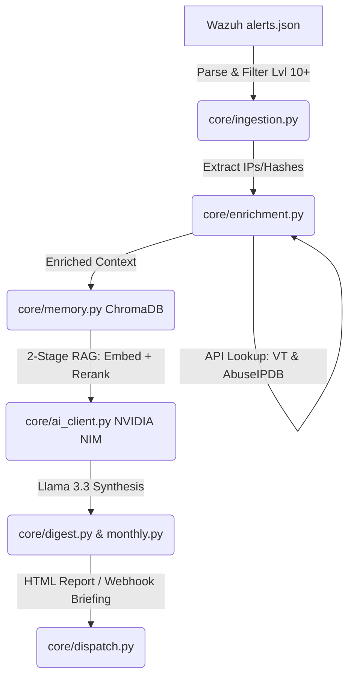

# Project Sentinel: Automated SOC Pipeline with NVIDIA AI

Project Sentinel is a fully automated, Dockerized SOC pipeline designed to ingest Wazuh SIEM alerts, enrich indicators of compromise (IOCs), maintain a historical vector memory using ChromaDB, and generate AI-driven security reports via the NVIDIA Build API.

---

## Key Features

- **Automated Ingestion:** Efficiently parses Wazuh `alerts.json`, filters high-priority events (Level 10+), and aggregates repeated alerts using Pandas.
- **Threat Intelligence Enrichment:** Automatically enriches IPs and hashes using **AbuseIPDB** and **VirusTotal** APIs with built-in rate limiting.
- **Real-Time Critical Alerting (Hot-Path):** Background monitoring of `alerts.json` for zero-latency detection of Level 12+ alerts with instant Webhook dispatch.
- **Active Response (SOAR):** Integrated with Wazuh API to execute automated remediation (e.g., blocking IPs) based on AI-driven confidence scores (Confidence >= 8).
- **Deep Root Cause Analysis (RCA):** Captures full forensic logs and process trees to generate detailed attack chains and entry-point hypotheses.
- **Historical Vector Memory (RAG):** Uses **ChromaDB** to store and query historical threat data. Features a 2-stage retrieval pipeline with the `nv-embedqa-e5-v5` embedding model and `rerank-qa-mistral-4b` reranker for optimal context.
- **AI-Driven Reporting:** Leverages **NVIDIA Build API** (`llama-3.3-nemotron-super-49b`) to generate professional daily and monthly security reports.
- **Enterprise-Ready NIM Architecture:** Designed for modularity; while currently using hosted APIs, the pipeline is architected to seamlessly drop-in on-premises **NVIDIA NIM** (Neural Inference Modules) containers for fully air-gapped, self-hosted deployments.
- **Multi-Channel Dispatch:** Delivers full HTML reports via **SMTP Email** and high-level executive briefings via **Webhooks**.
- **Self-Synthesizing Monthly Reports:** Maintains a daily digest log (`monthly_digest.jsonl`) that is synthesized into a strategic threat landscape report on the first of every month.

---

## Architecture

```text
Sentinel/
├── main.py                # Pipeline orchestration, scheduler & real-time monitor
├── core/
│   ├── ingestion.py       # Wazuh alert parsing & forensic normalization
│   ├── enrichment.py      # IP/Hash reputation lookups
│   ├── memory.py          # ChromaDB vector store management
│   ├── ai_client.py       # NVIDIA Build API interface
│   ├── monitor.py         # Real-time alert watcher (Hot-Path)
│   ├── response.py        # SOAR / Wazuh API remediation engine
│   ├── dispatch.py        # Email & Webhook delivery
│   ├── digest.py          # Daily JSON summary extraction
│   └── monthly.py         # Monthly synthesis engine
└── templates/             # LLM Prompt templates (Daily, Monthly, Digest)
```

### Pipeline Dataflow


## Architecture Philosophy: Framework-Agnostic RAG

Unlike standard AI applications that rely on heavy orchestration frameworks (LangChain/LlamaIndex), Sentinel utilizes a custom, low-overhead 2-stage retrieval pipeline built directly into `core/memory.py`.

### Why Custom?

1.  **Zero Abstraction Bloat:** Eliminating third-party wrappers minimizes the container's attack surface, reduces memory overhead, and speeds up Docker build times.
2.  **NVIDIA-Specific Optimization:** Direct control over the embedding pipeline allows exact passing of the `input_type` parameter (query vs. passage) required by NVIDIA NIM models for peak semantic accuracy.
3.  **Deterministic Fault Tolerance:** Built-in exception handling ensures that if the Stage 2 semantic reranker (`rerank-qa-mistral-4b`) faces API rate-limiting, the pipeline gracefully fails-safe to the top Stage 1 vector candidates, ensuring uninterrupted SOC reporting.

---

## Getting Started

### Prerequisites

- Docker and Docker Compose
- NVIDIA Build API Key
- (Optional) VirusTotal and AbuseIPDB API Keys
- Wazuh API Access (for SOAR features)
- SMTP Server access (e.g., Gmail App Password)

### Installation

1. **Clone the Repository:**
   ```bash
   git clone https://github.com/a-defaultt/Sentinel
   cd Sentinel
   ```

2. **Configure Environment Variables:**
   Copy the example environment file and fill in your details:
   ```bash
   cp .env.example .env
   ```
   Edit `.env` with your API keys and SOAR configuration:
   ```bash
   # SOAR Configuration
   WAZUH_API_URL=https://your-wazuh-manager:55000
   WAZUH_API_USER=admin
   WAZUH_API_PASS=your-password
   SOAR_MODE=AUDIT  # Set to ENFORCE for automated remediation
   ```

3. **Mount Wazuh Logs:**
   Ensure the volume mapping in `docker-compose.yml` points to your actual Wazuh alerts file:
   ```yaml
   volumes:
     - /var/ossec/logs/alerts/alerts.json:/app/data/alerts.json:ro
   ```

4. **Launch the Pipeline:**
   ```bash
   docker-compose up -d --build
   ```

---

## Schedule & Operation

- **Real-Time Alerts:** Runs continuously in the background for critical (Level 12+) events.
- **Daily Report:** Runs at **08:00 AM** every day.
- **Monthly Report:** Runs at **00:00 Midnight** on the 1st of every month.

To trigger an immediate run for testing, set `RUN_NOW=true` in your `.env` file and restart the container.

---

## Tech Stack

- **Language:** Python 3.11+
- **Data:** Pandas, ChromaDB
- **AI/LLM:** NVIDIA NIM (Llama 3.3 Nemotron, Mistral)
- **APIs:** VirusTotal, AbuseIPDB
- **Containerization:** Docker

---

## Security & Best Practices

- **API Keys:** Never commit your `.env` file to source control.
- **Read-Only Access:** The Wazuh alerts file is mounted as read-only to ensure system integrity.
- **Data Persistence:** Vector memory and digest logs are persisted in local volumes (`./chroma_data` and `./data`).

### LLM Security & Pipeline Integrity (The "Flex" Section)

Project Sentinel implements multiple layers of defense to ensure the AI pipeline remains secure and deterministic:

- **Prompt Defenses:** Advanced input sanitization on incoming Wazuh log fields (especially `full_log` and `command`) to prevent **indirect prompt injection** via malicious log payloads. Triple backticks and non-printable characters are stripped or escaped before data reaches the LLM.
- **Deterministic Formatting:** Uses strict system prompting and structured JSON schema enforcement for SOAR actions to eradicate **LLM hallucinations** in critical security reporting.
- **Contextual Isolation:** The AI is provided with isolated, relevant context via a 2-stage RAG pipeline, preventing "context poisoning" from large, irrelevant log volumes.
- **Action Guardrails:** All AI-recommended SOAR actions require a confidence score of >= 8/10 and can be run in `AUDIT` mode for human review before enforcement.

---

## License

This project is licensed under the MIT License - see the LICENSE file for details.

---

## Monitoring Status

Project Sentinel includes a lightweight utility to monitor container health and the last successful pipeline execution.

### Quick Status Check
Run the status script directly via Docker:
```bash
docker exec project-sentinel python3 core/status.py
```

### Add Shell Alias (Recommended)
To make status checks instant, add an alias to your `~/.bashrc`:
1. Open your bash config:
   ```bash
   nano ~/.bashrc
   ```
2. Add the following line at the end of the file:
   ```bash
   alias sentinel-status='docker exec project-sentinel python3 core/status.py'
   ```
3. Refresh your shell:
   ```bash
   source ~/.bashrc
   ```
4. Now, simply type **`sentinel-status`** to monitor your SOC pipeline.
