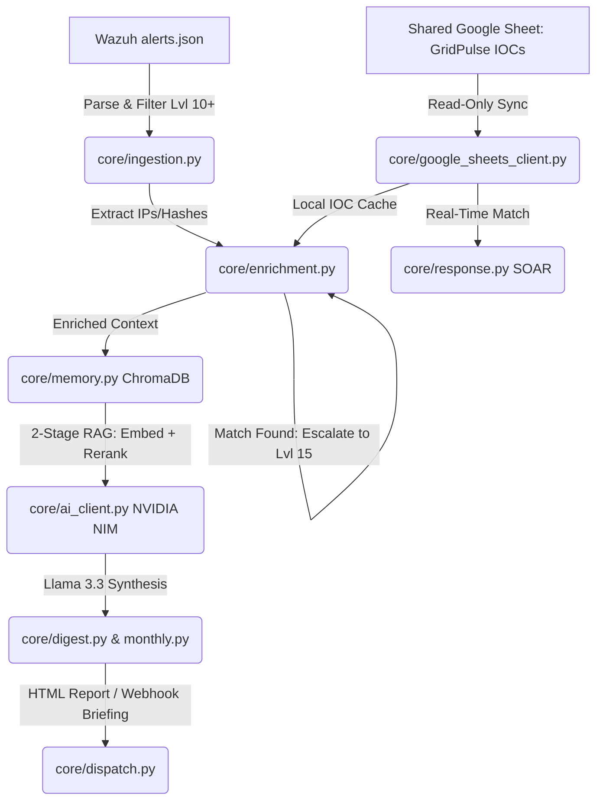

# Project Sentinel: Automated SOC Pipeline with NVIDIA AI

Project Sentinel is a fully automated, Dockerized SOC pipeline designed to ingest Wazuh SIEM alerts, enrich indicators of compromise (IOCs), maintain a historical vector memory using ChromaDB, and generate AI-driven security reports via the NVIDIA Build API.

---

## Key Features

- **Automated Ingestion:** Efficiently parses Wazuh `alerts.json`, filters high-priority events (Level 10+), and aggregates repeated alerts using Pandas.
- **Threat Intelligence Enrichment:** Automatically enriches IPs and hashes using **AbuseIPDB** and **VirusTotal** APIs with built-in rate limiting.
- **Real-Time Critical Alerting (Hot-Path):** Background monitoring of `alerts.json` for zero-latency detection of Level 12+ alerts, or any alert matching the GridPulse threat feed regardless of level, with instant Webhook dispatch.
- **GridPulse Threat Intel Feed:** Consumes the shared IOC feed published by [GridPulse](https://github.com/a-defaultt/GridPulse) via a read-only Google Sheets client. Matched alerts (by source IP or file hash) are escalated to Level 15 in daily reports and can trigger real-time remediation.
- **Active Response (SOAR):** Integrated with the Wazuh API to execute automated remediation (e.g., blocking IPs) based on AI-driven confidence scores (Confidence >= 8) or a direct GridPulse IOC match. Guardrails apply in every mode: private/reserved/protected IPs are never targeted, actions are capped per hour, and API dispatch failures are reported honestly rather than assumed successful.
- **Deep Root Cause Analysis (RCA):** Captures full forensic logs and process trees to generate detailed attack chains and entry-point hypotheses.
- **Historical Vector Memory (RAG):** Uses **ChromaDB** to store and query historical threat data. Features a 2-stage retrieval pipeline with the `nv-embedqa-e5-v5` embedding model and `rerank-qa-mistral-4b` reranker for optimal context.
- **AI-Driven Reporting:** Leverages **NVIDIA Build API** (`llama-3.3-nemotron-super-49b`) to generate professional daily and monthly security reports.
- **Enterprise-Ready NIM Architecture:** Designed for modularity; while currently using hosted APIs, the pipeline is architected to seamlessly drop-in on-premises **NVIDIA NIM** (Neural Inference Modules) containers for fully air-gapped, self-hosted deployments.
- **Multi-Channel Dispatch:** Delivers full HTML reports via **SMTP Email** and high-level executive briefings via **Webhooks**.
- **Self-Synthesizing Monthly Reports:** Maintains a daily digest log (`monthly_digest.jsonl`) that is synthesized into a strategic threat landscape report on the first of every month.

---

## Architecture

```text
Sentinel/
├── main.py                     # Pipeline orchestration, scheduler & real-time monitor
├── core/
│   ├── ingestion.py            # Wazuh alert parsing & forensic normalization
│   ├── enrichment.py           # IP/Hash reputation lookups + GridPulse IOC matching
│   ├── google_sheets_client.py # Read-only sync of the shared GridPulse IOC feed
│   ├── memory.py               # ChromaDB vector store management
│   ├── ai_client.py            # NVIDIA Build API interface
│   ├── monitor.py              # Real-time alert watcher (Hot-Path, rotation-aware)
│   ├── response.py             # SOAR / Wazuh API remediation engine
│   ├── dispatch.py             # Email & Webhook delivery (sanitized, retried)
│   ├── digest.py               # Daily JSON summary extraction
│   └── monthly.py              # Monthly synthesis engine
├── tests/                      # pytest suite (SOAR guardrails, GridPulse matching)
└── templates/                  # LLM Prompt templates (Daily, Monthly, Digest)
```

### Pipeline Dataflow

```mermaid
graph TD
    S[Shared Google Sheet: GridPulse IOCs] -->|Read-Only Sync| GS(core/google_sheets_client.py)
    A[Wazuh alerts.json] -->|Parse & Filter Lvl 10+| B(core/ingestion.py)
    B -->|Extract IPs/Hashes| C(core/enrichment.py)
    C -->|API Lookup: VT & AbuseIPDB| C
    GS -->|Local IOC Cache| C
    C -->|Match Found: Escalate to Lvl 15| C
    C -->|Enriched Context| D(core/memory.py ChromaDB)
    D -->|2-Stage RAG: Embed + Rerank| E(core/ai_client.py NVIDIA NIM)
    E -->|Llama 3.3 Synthesis| F(core/digest.py & monthly.py)
    F -->|HTML Report / Webhook Briefing| G(core/dispatch.py)
    GS -->|Real-Time Match| R(core/response.py SOAR)
```

## Architecture Philosophy: Framework-Agnostic RAG

Unlike standard AI applications that rely on heavy orchestration frameworks (LangChain/LlamaIndex), Sentinel utilizes a custom, low-overhead 2-stage retrieval pipeline built directly into `core/memory.py`.

### Why Custom?

1.  **Zero Abstraction Bloat:** Eliminating third-party wrappers minimizes the container's attack surface, reduces memory overhead, and speeds up Docker build times.
2.  **NVIDIA-Specific Optimization:** Direct control over the embedding pipeline allows exact passing of the `input_type` parameter (query vs. passage) required by NVIDIA NIM models for peak semantic accuracy.
3.  **Deterministic Fault Tolerance:** Built-in exception handling ensures that if the Stage 2 semantic reranker (`rerank-qa-mistral-4b`) faces API rate-limiting, the pipeline gracefully fails-safe to the top Stage 1 vector candidates, ensuring uninterrupted SOC reporting.

---

## Getting Started

### Prerequisites

- Docker and Docker Compose
- NVIDIA Build API Key
- (Optional) VirusTotal and AbuseIPDB API Keys
- Wazuh API Access (for SOAR features)
- SMTP Server access (e.g., Gmail App Password)
- (Optional) A GCP service account with **read-only** access to the shared GridPulse IOC Google Sheet, for threat feed matching

### Installation

1. **Clone the Repository:**
   ```bash
   git clone https://github.com/a-defaultt/Sentinel
   cd Sentinel
   ```

2. **Configure Environment Variables:**
   Copy the example environment file and fill in your details:
   ```bash
   cp .env.example .env
   ```
   Edit `.env` with your API keys and SOAR configuration:
   ```bash
   # SOAR Configuration
   WAZUH_API_URL=https://your-wazuh-manager:55000
   WAZUH_API_USER=admin
   WAZUH_API_PASS=your-password
   WAZUH_API_VERIFY_SSL=true          # or a path to a CA bundle
   WAZUH_AR_COMMAND=!firewall-drop    # the '!' runs the script directly, no <active-response> block required
   SOAR_MODE=AUDIT                    # Set to ENFORCE for automated remediation
   SOAR_MAX_ACTIONS_PER_HOUR=5
   SOAR_PROTECTED_IPS=                # comma-separated IPs that must never be blocked (gateway, DNS, manager)

   # GridPulse Threat Intel Feed (optional)
   GOOGLE_SHEETS_CREDENTIALS_PATH=/app/data/google-service-account.json
   GOOGLE_SHEET_ID=your-spreadsheet-id
   GOOGLE_SHEET_WORKSHEET_NAME=IOCs
   ```

3. **Mount Wazuh Logs:**
   `docker-compose.yml` mounts the Wazuh alerts **directory** (not the single file) so the container survives log rotation. Ensure the volume mapping points to your actual Wazuh alerts directory:
   ```yaml
   volumes:
     - /var/ossec/logs/alerts:/app/wazuh-alerts:ro
   environment:
     - ALERTS_JSON_PATH=/app/wazuh-alerts/alerts.json
     - TZ=Africa/Tunis   # scheduled runs fire in container-local time
   ```

4. **Launch the Pipeline:**
   ```bash
   docker-compose up -d --build
   ```

---

## Schedule & Operation

- **Real-Time Alerts:** Runs continuously in the background for critical (Level 12+) events, or any alert matching the GridPulse threat feed regardless of level.
- **Daily Report:** Runs at **08:00 AM** every day — starts by syncing the GridPulse IOC feed, then ingests, enriches, and reports.
- **Monthly Report:** Runs at **00:00 Midnight** on the 1st of every month.

To trigger an immediate run for testing, set `RUN_NOW=true` in your `.env` file and restart the container.

---

## Tech Stack

- **Language:** Python 3.11+
- **Data:** Pandas, ChromaDB
- **AI/LLM:** NVIDIA NIM (Llama 3.3 Nemotron, Mistral)
- **APIs:** VirusTotal, AbuseIPDB, Wazuh API (SOAR)
- **Threat Intel Feed:** Google Sheets API (`gspread`, read-only service-account auth)
- **Email Security:** `bleach` HTML sanitization for outbound reports
- **Containerization:** Docker (non-root, healthchecked)

---

## Security & Best Practices

- **API Keys:** Never commit your `.env` file or `data/google-service-account.json` to source control — both are gitignored by default.
- **Read-Only Access:** The Wazuh alerts directory is mounted read-only, and the Google Sheets client uses a read-only (`spreadsheets.readonly`) scope — Sentinel can never write to the shared GridPulse feed.
- **Data Persistence:** Vector memory and digest logs are persisted in local volumes (`./chroma_data` and `./data`).
- **SOAR Guardrails:** Regardless of `SOAR_MODE`, actions targeting private/reserved/invalid IPs or any address in `SOAR_PROTECTED_IPS` are refused, executed actions are capped per hour, and a Wazuh API dispatch that reaches zero agents is reported as a failure rather than a false success.
- **Container Hardening:** The image runs as a non-root user, secrets are excluded from build context via `.dockerignore`, and a healthcheck monitors the scheduler heartbeat.
- **Email Sanitization:** Report HTML (LLM output over attacker-influenced log data) is passed through a `bleach` allowlist before dispatch, stripping any injected script/iframe/`javascript:` content.

### LLM Security & Pipeline Integrity (The "Flex" Section)

Project Sentinel implements multiple layers of defense to ensure the AI pipeline remains secure and deterministic:

- **Prompt Defenses:** Advanced input sanitization on incoming Wazuh log fields (especially `full_log` and `command`) to prevent **indirect prompt injection** via malicious log payloads. Triple backticks and non-printable characters are stripped or escaped before data reaches the LLM.
- **Deterministic Formatting:** Uses strict system prompting and structured JSON schema enforcement for SOAR actions to eradicate **LLM hallucinations** in critical security reporting.
- **Contextual Isolation:** The AI is provided with isolated, relevant context via a 2-stage RAG pipeline, preventing "context poisoning" from large, irrelevant log volumes.
- **Action Guardrails:** All AI-recommended SOAR actions require a confidence score of >= 8/10 and can be run in `AUDIT` mode for human review before enforcement. Independently of confidence or mode, target validation (no private/reserved/protected IPs), a per-hour action cap, and honest dispatch-failure reporting always apply.

---

## Testing

Run the pytest suite (mocked APIs — no live Wazuh or Google Sheets required, except the one integration test which skips automatically if credentials aren't configured):

```bash
pip install -r requirements.txt
python -m pytest tests/ -v
```

Covers: SOAR guardrails and dispatch mechanics (`test_response_soar.py`), GridPulse IOC matching and cache handling (`test_google_sheets_iocs.py`).

---

## License

This project is licensed under the MIT License - see the LICENSE file for details.

---

## Monitoring Status

Project Sentinel includes a lightweight utility to monitor container health and the last successful pipeline execution.

### Quick Status Check
Run the status script directly via Docker:
```bash
docker exec project-sentinel python3 core/status.py
```

### Add Shell Alias (Recommended)
To make status checks instant, add an alias to your `~/.bashrc`:
1. Open your bash config:
   ```bash
   nano ~/.bashrc
   ```
2. Add the following line at the end of the file:
   ```bash
   alias sentinel-status='docker exec project-sentinel python3 core/status.py'
   ```
3. Refresh your shell:
   ```bash
   source ~/.bashrc
   ```
4. Now, simply type **`sentinel-status`** to monitor your SOC pipeline.
